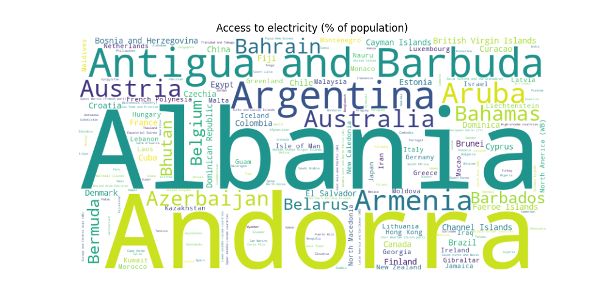

# Visualizacion de datos PEC2

En esta actividad se han creado trestres pequeñas visualizaciones usando técnicas diferentes. 

## Tipos de visualizaciones

- [Tag Cloud](#Tag_Cloud)
- [Icon Chart](#uso)
- [Beeswarm Chart](#contribución)

## Tag Cloud 

Fuente de datos: Access to electricity vs. GDP per capita, 2020 [link](https://ourworldindata.org/grapher/access-to-electricity-vs-gdp-per-capita?country=%C2%AEion~BHR~BGD~BRN~HKG~IND~IDN~ISR~JPN~JOR~KAZ~KWT~LAO~MAC~OMN~PHL~SAU~SGP~KOR~ARE~NPL~UZB~KGZ~PSE~VNM~KHM~PAK~AZE~TJK~ARM~BTN~CHN~TLS~GEO~IRN~IRQ~LBN~MYS~MDV~MNG~MMR~QAT~LKA~THA~TUR~TKM~AFG)

Se puede encontrar la información en [ourworldindata](https://ourworldindata.org/worlds-energy-problem).

